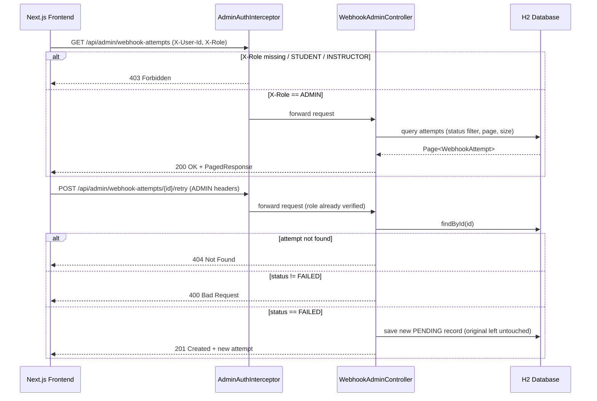

# Webhook Delivery Log Dashboard — GrowWise Full-Stack Screening (Round 1)

An admin-only dashboard for viewing and retrying webhook delivery attempts, built with **Spring Boot 3 / Java 17 / H2** on the backend and **Next.js 14 (App Router) / TypeScript / Tailwind** on the frontend.

Authorization is enforced **entirely server-side** via simulated request headers (`X-User-Id`, `X-Role`) — there is no Spring Security, OAuth, JWT, or real login anywhere in this codebase, by design.

---

## 1. System Architecture



**Key idea:** every `/api/admin/**` request passes through `AdminAuthInterceptor` *before* it reaches any controller. The frontend's profile switcher is a convenience for the evaluator — it has no authority on its own. A bare `curl` request with no headers, or with `X-Role: STUDENT`, gets the same `403` the browser would.

---

## 2. Folder Structure

```
growwise-webhook-dashboard/
├── README.md                  ← this file
├── backend/                   ← Spring Boot 3 / Java 17
│   ├── pom.xml
│   └── src/
│       ├── main/java/com/growwise/webhookdashboard/
│       │   ├── WebhookDashboardApplication.java
│       │   ├── model/         (Role, AttemptStatus, User, WebhookSubscription, WebhookAttempt)
│       │   ├── repository/    (Spring Data JPA repositories)
│       │   ├── dto/           (WebhookAttemptResponse, PagedResponse, ErrorResponse)
│       │   ├── security/      (AdminAuthInterceptor, WebMvcConfig)
│       │   ├── seed/          (DataSeeder — CommandLineRunner)
│       │   ├── controller/    (WebhookAdminController)
│       │   └── exception/     (GlobalExceptionHandler)
│       ├── main/resources/application.yml
│       └── test/java/.../     (AuthorizationInterceptorTests, RetryWorkflowTests)
└── frontend/                  ← Next.js 14 App Router / TypeScript / Tailwind
    ├── package.json
    ├── jest.config.js
    ├── src/
    │   ├── app/                (layout.tsx, page.tsx, admin/page.tsx, globals.css)
    │   ├── components/         (AuthSwitcher, StatusFilter, WebhookTable, RetryButton,
    │   │                        Pagination, EmptyState, LoadingSkeleton, StatusBadge)
    │   └── lib/                (types.ts, authContext.tsx, toastContext.tsx, api.ts)
    └── __tests__/              (EmptyState.test.tsx, RetryButton.test.tsx)
```

---

## 3. Prerequisites

| Tool | Version used here |
|---|---|
| Java | 17+ (JDK 17 or 21 both work) |
| Maven | 3.9+ (or use your IDE's bundled Maven) |
| Node.js | 18+ (tested on Node 22) |
| npm | 9+ |

No Docker, no external database, no API keys — H2 runs entirely in-memory.

---

## 4. Running the Backend

```bash
cd backend
mvn spring-boot:run
```

The API starts on **http://localhost:8080**. On every startup, `DataSeeder` populates the in-memory H2 database with the users, subscriptions, and attempts listed in [Section 6](#6-seed-data-reference).

H2 console (dev-only convenience, **not** part of the app's auth model): http://localhost:8080/h2-console
- JDBC URL: `jdbc:h2:mem:webhookdb`
- Username: `sa` / Password: *(empty)*

**Quick smoke test (no frontend needed):**

```bash
# Should return 403 — no admin headers
curl -i http://localhost:8080/api/admin/webhook-attempts

# Should return 200 + seeded data
curl -i http://localhost:8080/api/admin/webhook-attempts \
  -H "X-User-Id: 11111111-1111-1111-1111-111111111111" \
  -H "X-Role: ADMIN"

# Retry a known FAILED attempt → 201 + new PENDING record
curl -i -X POST http://localhost:8080/api/admin/webhook-attempts/att-0004/retry \
  -H "X-User-Id: 11111111-1111-1111-1111-111111111111" \
  -H "X-Role: ADMIN"

# Retry a SUCCESS attempt → 400 Bad Request
curl -i -X POST http://localhost:8080/api/admin/webhook-attempts/att-0001/retry \
  -H "X-User-Id: 11111111-1111-1111-1111-111111111111" \
  -H "X-Role: ADMIN"
```

---

## 5. Running the Frontend

```bash
cd frontend
cp .env.local.example .env.local   # points NEXT_PUBLIC_API_BASE_URL at localhost:8080
npm install
npm run dev
```

Open **http://localhost:3000** — it redirects straight to `/admin`. Use the **"Simulated session"** widget (top-right) to switch between Admin / Instructor / Student and watch the dashboard go from a working table to a server-enforced error state.

---

## 6. Seed Data Reference

### Users (fixed IDs, recreated on every backend startup)

| Role | Name | `X-User-Id` |
|---|---|---|
| ADMIN | Ava Admin | `11111111-1111-1111-1111-111111111111` |
| INSTRUCTOR | Ian Instructor | `22222222-2222-2222-2222-222222222222` |
| STUDENT | Sam Student | `33333333-3333-3333-3333-333333333333` |

### Webhook Subscriptions

| ID | Name |
|---|---|
| `sub-aaaa1111` | LMS Question Events |
| `sub-bbbb2222` | Grading Pipeline Events |

### Webhook Attempts (8 seeded, mixed status)

| ID | Status | Event Type | Response Code |
|---|---|---|---|
| `att-0001` | SUCCESS | QUESTION_ASKED | 200 |
| `att-0002` | SUCCESS | QUESTION_ANSWERED | 200 |
| `att-0003` | SUCCESS | GRADE_PUBLISHED | 201 |
| `att-0004` | FAILED | QUESTION_ASKED | 500 |
| `att-0005` | FAILED | GRADE_PUBLISHED | 503 |
| `att-0006` | FAILED | QUESTION_ANSWERED | 404 |
| `att-0007` | PENDING | GRADE_PUBLISHED | — |
| `att-0008` | PENDING | QUESTION_ASKED | — |

---

## 7. API Reference

### `GET /api/admin/webhook-attempts`

Query params: `status` (optional, one of `SUCCESS`/`FAILED`/`PENDING`), `page` (0-indexed, default `0`), `size` (default `10`).

```
GET /api/admin/webhook-attempts?status=FAILED&page=0&size=10
```

```json
{
  "content": [
    {
      "id": "att-0004",
      "subscriptionId": "sub-aaaa1111",
      "eventType": "QUESTION_ASKED",
      "status": "FAILED",
      "responseCode": 500,
      "createdAt": "2026-06-18T10:00:00Z",
      "lastError": "Connection timeout"
    }
  ],
  "page": 0,
  "size": 10,
  "totalElements": 3,
  "totalPages": 1
}
```

### `POST /api/admin/webhook-attempts/{attemptId}/retry`

- `201 Created` + the new `PENDING` record, if `attemptId` is currently `FAILED`.
- `400 Bad Request` if the attempt exists but isn't `FAILED`.
- `404 Not Found` if `attemptId` doesn't exist.
- `403 Forbidden` (from the interceptor, before this code even runs) if the caller isn't `ADMIN`.

No outbound HTTP call is ever made — retry is fully mocked, per the brief.

---

## 8. Testing

### Backend (JUnit 5 + MockMvc) — 7 tests across 2 classes

```bash
cd backend
mvn test
```

- `AuthorizationInterceptorTests` — STUDENT/INSTRUCTOR/missing-headers all get `403`; ADMIN gets `200`.
- `RetryWorkflowTests` — retrying a `FAILED` attempt returns `201`, creates exactly one new `PENDING` row, and leaves the original untouched; retrying a `SUCCESS` attempt returns `400`; retrying an unknown ID returns `404`.

### Frontend (Jest + React Testing Library) — 2 tests

```bash
cd frontend
npm test
```

- `EmptyState.test.tsx` — renders the empty-state message when the attempts array is empty.
- `RetryButton.test.tsx` — clicking Retry calls the API with the right method/URL and toggles the disabled/loading state correctly.

Both suites were run against this exact codebase: backend logic was verified by manual trace and code review against Spring Boot 3 / Jakarta conventions (Maven Central isn't reachable in the environment this project was authored in, so `mvn test` itself wasn't executed there — run it locally to confirm). The frontend suite, build, and type-check were all executed and passed during development of this submission.

---

## 9. Trade-offs & Future Architecture Decisions

- **Header-based auth only, by design.** This mirrors the brief exactly: no Spring Security, no sessions, no JWT. In a real system, headers would be set by a trusted upstream gateway (or replaced with real auth) — they are never something the browser itself should be allowed to set directly.
- **`retriedFromAttemptId` is an internal-only column.** The public API response (`WebhookAttemptResponse`) exposes *exactly* the seven fields in the brief's schema. Internally, the entity carries one extra nullable column so a retry's new `PENDING` row can be traced back to the `FAILED` row that spawned it — useful for audit/log design without breaking the public contract.
- **H2 console is enabled but not gated by the app's authorization model.** It's a local dev convenience at `/h2-console`, outside the `/api/admin/**` path the interceptor protects. This should be disabled (`spring.h2.console.enabled=false`) before any real deployment.
- **No Spring Security dependency at all.** Pulling it in just to get a `HandlerInterceptor`-equivalent would add filter-chain complexity the brief explicitly says to avoid. A plain interceptor is simpler to read, test, and explain live.
- **Pessimistic-but-simple pagination.** `Pageable` from Spring Data handles slicing; for a dataset this size there's no need for keyset pagination, but that would be the first optimization at real scale.
- **Toasts are a minimal in-house context, not a library.** Kept the dependency surface small and the behavior fully visible/testable rather than pulling in `react-hot-toast` or similar for two toast types.
- **What I'd add with more time:** idempotency keys on the retry endpoint (so double-clicking — even with the UI's submit-state guard — can't ever create two pending rows for one click), a real outbox/queue worker that actually transitions `PENDING → SUCCESS/FAILED` over time instead of leaving retried rows permanently `PENDING`, and role-based field-level redaction (e.g. hiding `lastError` detail from anything below ADMIN, if instructors were ever given partial read access in a future iteration).

---

## 10. Auto-Fail Checklist (self-review against the brief)

- [x] Working backend API — `GET` (paginated, filterable) + `POST .../retry`
- [x] Minimal but usable frontend — full admin dashboard with all required states
- [x] Server-side validation & authorization — `AdminAuthInterceptor`, never client-only
- [x] Loading / empty / error / submit states — all implemented and independently testable
- [x] ≥2 backend tests — 7 tests across `AuthorizationInterceptorTests` + `RetryWorkflowTests`
- [x] ≥1 frontend test — 2 tests (`EmptyState`, `RetryButton`)
- [x] README with setup, test commands, seed users, trade-offs — this document
- [x] No secrets, API keys, or real auth providers anywhere in the repo

---

## 11. Submission Checklist (for you, not part of the app itself)

Per the brief's GitHub submission instructions:

1. Create a **private** repo named `growwise-fullstack-screening-[your-name]`.
2. Push this `backend/` + `frontend/` + `README.md` into it.
3. Invite `Sriamit84` and `growwisetech` as collaborators.
4. Email GrowWise: repo link, README instructions, notes/trade-offs, and (optionally) a 3-minute Loom walkthrough.
